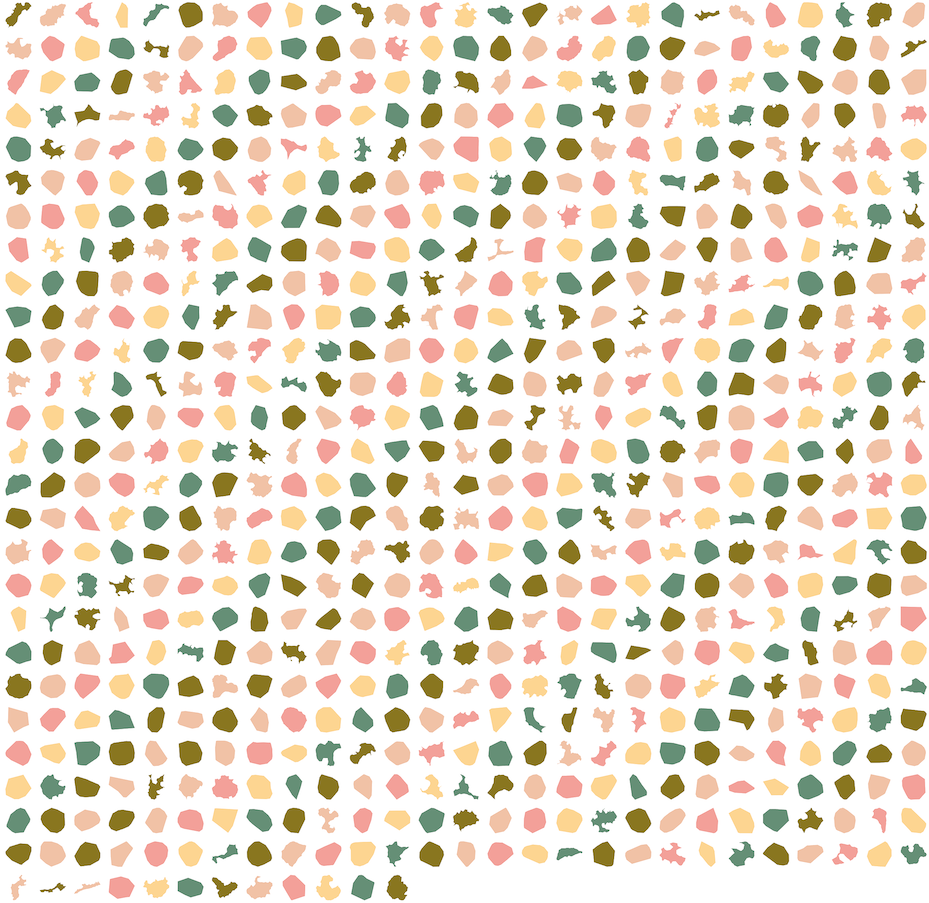

# *Building(s and) Cities*

Repository for the paper "Building(s and) cities: Delineating urban areas with a machine learning algorithm", forthcoming in the Journal of Urban Economics.

Authors:

- [Dani Arribas-Bel](https://darribas.org) `[[@darribas](https://twitter.com/darribas)]`
- [Miquel-Angel Garcia-Lopez](http://gent.uab.cat/miquelangelgarcialopez/ca/content/home) `[[@MiquelAngelGL](https://twitter.com/MiquelAngelGL)]`
- [Elisabet Viladecans-Marsal](https://elisabetviladecans.wordpress.com/) `[[@eviladecans](https://twitter.com/eviladecans)]`



## Citation

If you use the code and/or data in this repository, we would appreciate if you
could cite the original paper as:

```
@article{ab_gl_vm2019joue,
  title={Building(s and) cities: 
         Delineating urban areas with a machine learning algorithm},
  author={Arribas-Bel, Daniel and 
          Garcia-L\`{o}pez, Miquel-\'{A}ngel and
          Viladecans-Marsal, Elisabet},
  journal={Journal of Urban Economics},
  year={\emph{forthcoming}},
}
```


